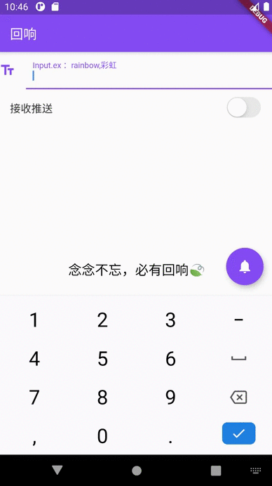
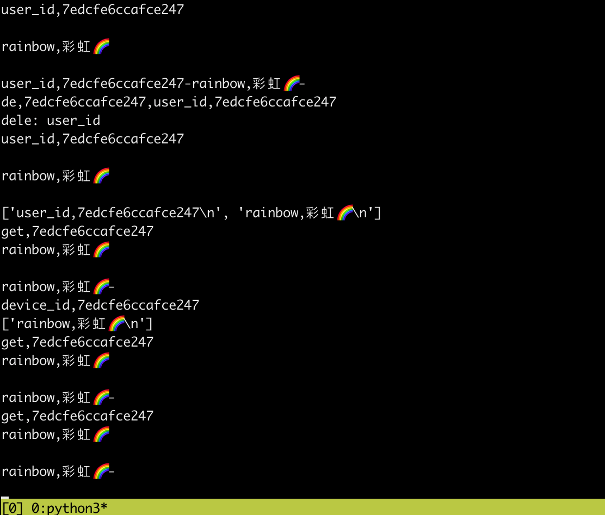

# Think_Review
# 一个开源的Flutter前端+Python后端的尝试

## **1.起源**

2020年的寒假,我考虑一个更高效的单词速记方式

而最好的记忆即频繁的往返重复,可以不断激活这部分神经,达到记忆效果,这就是这个小工具的来源,原先只做了mac版本的代码,测试效果还可以,后朋友完善了win下的代码,最终希望在手机上也能够使用起来,这样我们可以更高效地利用使用手机的碎片化时间,只需要一个特殊的通知服务--**词汇推送**

## 技术栈:

>   Flutter+Python后端,无中间件结构
>
>   通信方式:Websocket+异步通信
>
>   flutter : 本地发送端
>
>   服务器 : (阿里云) Python实现异步通信和简单辨识

在回响的输入框中,输入你近期想熟悉记忆的词汇和他的中文释义, 以逗号分隔

例如:rainbow,彩虹

记得确保是英文逗号, 而后点击右下角的通知按钮,即可在云端同步储存,打开推送功能开关,	   服务器会根据时间和遗忘曲线确定推送频率(代码已模糊成随机函数),帮助你熟悉你所要记忆的词汇

>   注意事项:
>
>   1.打开通知权限(横幅,锁屏,悬浮等)
>
>   2.打开后台常驻(保证持续推送)
>
>   3.勿重装系统,易导致用户id丢失

## **Demo**:

已实现功能:

√ 发送到服务器,储存在云端

√ 接收来自服务器的推送,时间频率由内容+时间确定

√ 显示推送,使用通知,横幅通知or锁屏

√ 后台根据遗忘曲线+综合数据决策随机推送

√ 自主选择接收推送或者拒绝推送

√ 从云端拉取单词list,适时review.

√ 使用获取唯一标识方式,来取代登录功能 (测试)

Download_link : 

​	http://likedge.top/think_and_review.apk

后台讯息:

